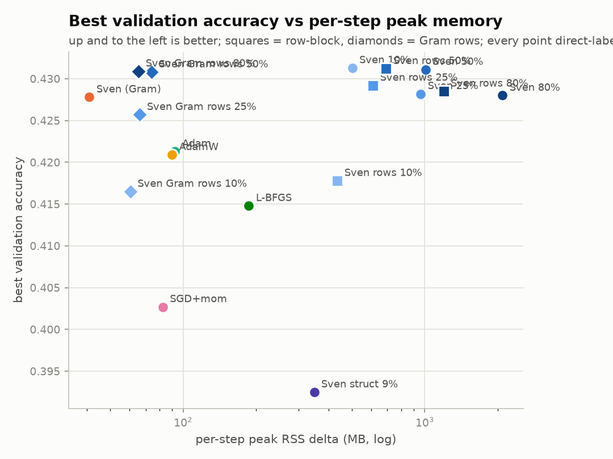
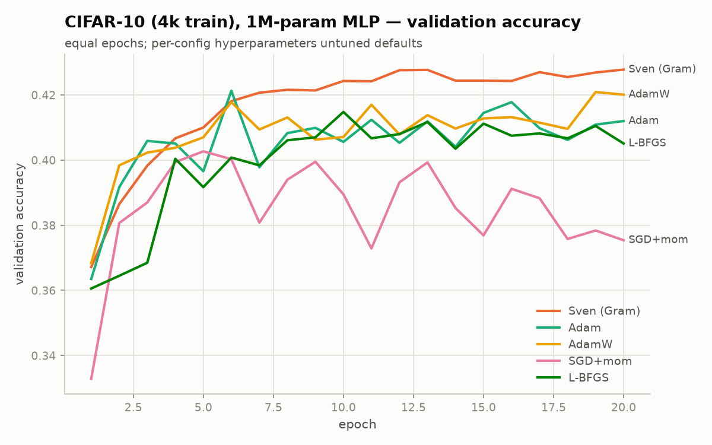
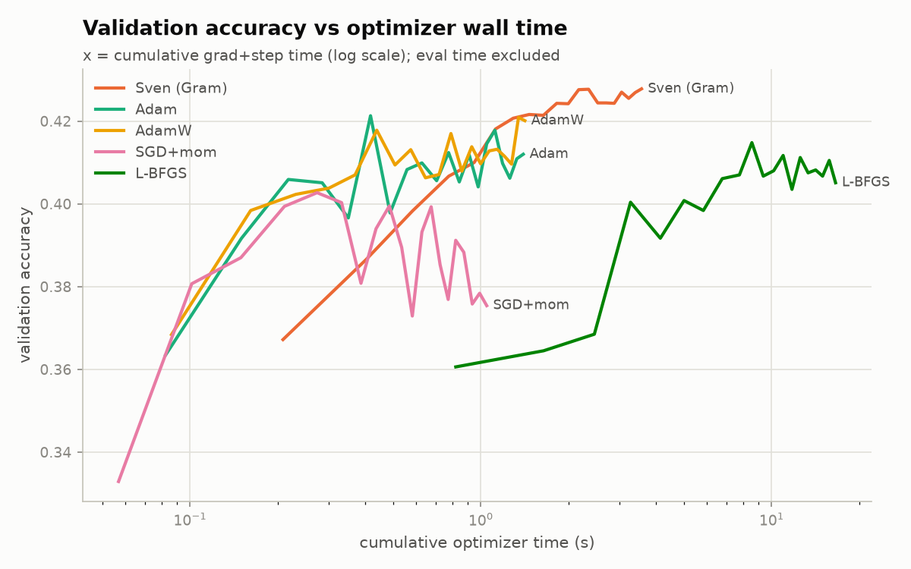
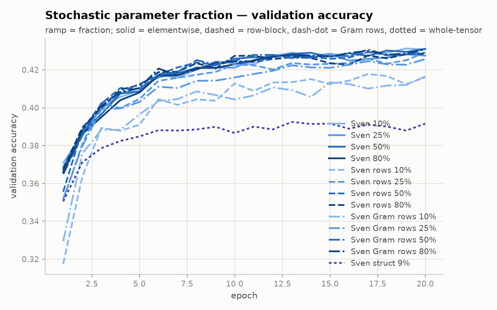
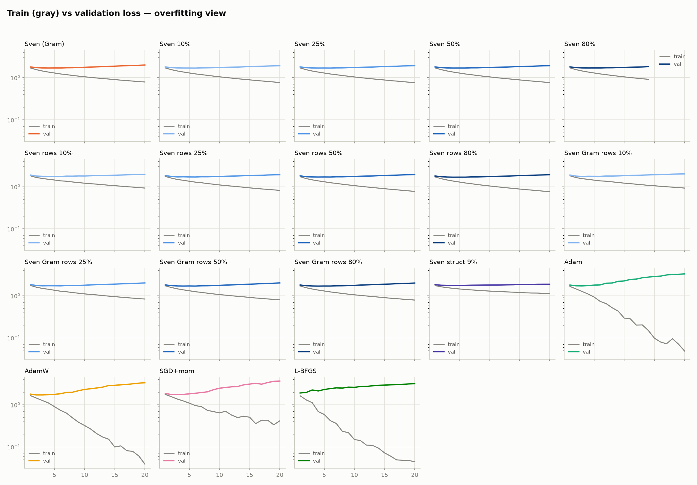
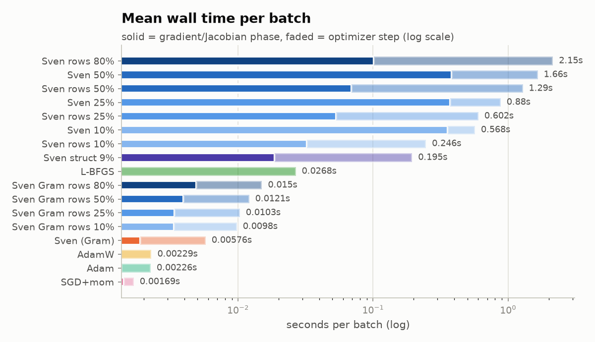
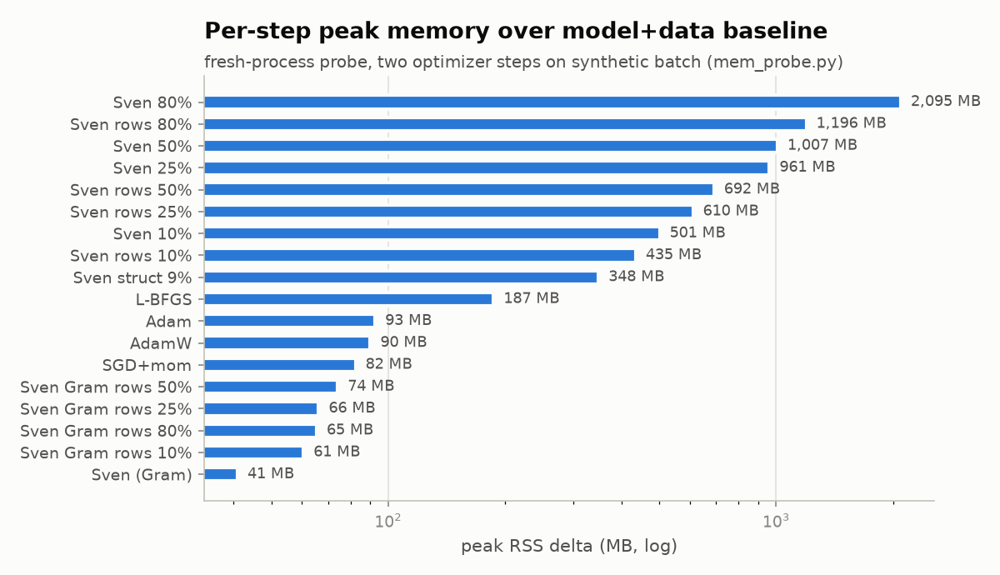

# Sven efficiency upgrades: the Gram-trick optimizer and structural stochastic-parameter masking

**Date:** 2026-07-24 · **Branch:** `stochastic_params` · **Commits:** `28040f4`, `0c62957`, `edac0df` · **Tests:** 69 passing
*Prepared by Sam Bright-Thonney with Claude (Anthropic). All headline numbers were produced by scripted benchmarks in `comparisons/` and adversarially re-verified by independent re-runs; exactness claims are backed by unit tests in `tests/`.*

---

## 1. Executive summary

Sven computes its update `δθ = −η·J⁺r` from the pseudoinverse of a per-sample Jacobian `J` (B loss rows × P parameters). Materializing `J` and taking its SVD dominated both memory and wall time, and the existing stochastic-parameter option (`param_fraction`) did not help, because of how reverse-mode autodiff actually works. Today's changes:

1. **Diagnosis (measured, both frameworks):** the existing masked path saves **no** Jacobian memory or compute — reverse-mode AD materializes the full `(B, P)` cotangent and then gathers. This includes the JAX implementation, whose docstring claimed otherwise.
2. **The Gram-trick optimizer** (`GramSvenWrapper` + `SvenGram`, PyTorch and JAX): computes the **exact same update** without ever building `J`, via the `B×B` Gram matrix `G = JJᵀ`. End-to-end: **~400× faster and ~50× less peak memory** than the current pipeline at P ≈ 1M, B = 128 (5.8 ms and +41 MB per step vs ~2.4–3.1 s and ~+1.8–2.5 GB).
3. **Row-block structural masking** (`mask_mode="rows"`): makes stochastic-parameter updates *genuinely* cheap in the Jacobian path — memory and compute now scale with the masked fraction — and fixes a coverage pathology of whole-tensor masking.
4. **Masked Gram**: the two compose. Stochastic-parameter scans now run at **constant memory (~+65 MB) and ~10–15 ms/step at any fraction** — a 4-point × 20-epoch fraction scan that took ~44 min via the Jacobian path completes in ~30 s of optimizer time, computing the identical masked update.
5. **Benchmark results (CIFAR-10 subset, 1M-param MLP):** the full-update and ≥25 %-fraction Sven variants (9 of 12) beat Adam/AdamW/SGD/L-BFGS on validation accuracy (0.426–0.431 vs ≤0.421) while *barely overfitting* — the truncated min-norm update acts as a strong implicit regularizer — and the Gram variants deliver this at Adam-class cost. (The 10 %-row variants land at 0.417, between L-BFGS and Adam; a deliberately pinned-selection control lands at 0.393 and isolates the coverage failure mode.)

| pipeline (per optimizer step, P≈1M, B=128, CPU) | wall time | peak memory over baseline |
|---|---|---|
| original: `SvenWrapper` + `pinv` (full SVD) | ~9.8–11.6 s | ~+2.2–2.5 GB |
| original + `randomized_v3` SVD | ~2.4–3.1 s | ~+1.8–2.5 GB |
| original masked, `param_fraction=0.1` (elementwise) | ~2.0 s | **no reduction** (+2.3–2.5 GB) |
| new: row-block masked Jacobian, 10 % | 0.25 s | +0.4 GB |
| **new: Gram trick (full update)** | **5.8 ms** | **+41 MB** |
| **new: Gram trick + row mask (any fraction)** | **10–15 ms** | **+61–74 MB** |

---

## 2. Background: the original implementation

`SvenWrapper` ties all model parameters to one flat vector, runs the model functionally (`torch.func.functional_call`), and computes the per-sample Jacobian of the residuals `r = ℓ^{κ/2}` (optionally microbatch-grouped) with `torch.func.jacrev`. `Sven.step` then takes a truncated SVD of `J` (`pinv.py`: full `torch.linalg.svd` or randomized variants), keeps `k` components above `rtol·σ_max`, and applies `δθ = −η · V_k S_k^{-1} U_kᵀ r`.

For the CIFAR-10 ResNet-18 experiments (P ≈ 11.2M, B = 128), `J` alone is 5.7 GB in fp32, and the transient memory of computing it is roughly double that. The `param_fraction` option was intended to relieve this by differentiating only a random subset of parameters each step: the wrapper passed the masked slice `params[mask]` as the differentiated argument and scattered it into a clone of the full flat vector inside the loss function. Experiments showed the *optimization quality* survives masking remarkably well — but the memory relief never materialized.

## 3. Diagnosis: why the original masking saved nothing

### 3.1 Autograd's selectivity is per-tensor, not per-element

Reverse-mode AD decides what to differentiate topologically: every op on the path from a differentiated leaf to the output computes cotangents for its inputs, and the granularity of the "skip this gradient" decision (`needs_input_grad`) is a whole input tensor of an op. Dense kernels (matmul, conv) have dense backwards — there is no mechanism to compute "only these entries" of `∂ℓ/∂W`.

The masked implementation scatters the small active vector *into* the full flat vector (`input_params = params.clone(); input_params[mask] = active`). From that point on the **entire** flat vector lies on the differentiated path; the backward of scatter is gather, so the mask manifests only as the **final** op of the backward pass, slicing an already-computed `(B, P)` cotangent down to `(B, n_active)`. Under `jacrev` (= `vmap` over `vjp`s) every intermediate carries the batch axis, so the full per-sample Jacobian is materialized regardless of the mask.

### 3.2 The flat-vector design amplifies the cost

Because each layer's weight is a *slice view* of one flat vector, each slice's backward creates a **full-width zero-padded** `(B, P)` buffer, which autograd then sums pairwise. A per-op profiler trace on a 5-layer MLP whose full Jacobian is 17.2 MB (10 parameter tensors) shows exactly this: `aten::empty` allocates 174.7 MB ≈ **10 ×** the Jacobian (one full-width buffer per parameter tensor) and `aten::add` 154.8 MB ≈ **9 ×** (the accumulations). The masked run allocates slightly *more* than the full run (356.9 vs 353.2 MB total) — the gather is pure overhead.

### 3.3 Measurements (PyTorch)

MLP 64 → 8×384 → 10 (P = 1,063,690), B = 128, fp32, CPU; peak RSS over a model-and-data baseline, fresh process per config; full Jacobian = 544.6 MB:

| configuration | peak Δ | wall |
|---|---|---|
| full `jacrev` (real `SvenWrapper`) | +2232 MB | 2.10 s |
| masked, `param_fraction=0.1` (current path) | +2478 MB | 2.03 s |
| masked, `param_fraction=0.01` | +2296 MB | 1.89 s |
| masked + `jacrev(chunk_size=8)` | +768 MB | 1.36 s |
| dict-`jacrev` over one weight tensor (13.9 % of P) | +277 MB | 0.53 s |
| split-matmul row mask, ~10 % (prototype of §5) | +320 MB | 0.64 s |
| manual per-sample grads, one backward (full `J`) | +1258 MB | 0.03 s |
| manual + elementwise gather, 10 % | +307 MB | 0.02 s |
| **end-to-end step:** wrapper + `pinv(torch)` + update | +2406 MB | 9.76 s |
| **end-to-end step: Gram trick (§4 prototype)** | **+92 MB** | **0.01 s** |

Repeated trials showed the masked-vs-full *ordering* is single-shot RSS noise, but the substantive result is decisive: a 100× smaller output buys at most ~11 % peak reduction. Adding `chunk_size` is the only lever inside the old design (3.2× for one line — now exposed as `jac_chunk_size`), and the structural approaches below are ~8× cheaper.

### 3.4 The JAX implementation has the same problem (docstring falsified)

The JAX wrapper claimed its `stop_gradient` + scatter construction made the masked Jacobian "genuinely `(B, n_active)` both in memory and in compute." Empirically, on both an MLP and a CNN: XLA-reported FLOPs are **identical** across `param_fraction` 1.0/0.1/0.01 (69.17/69.20/69.18 GFLOP MLP; 307.40 GFLOP all three, CNN); compiled temporary buffers are ~1.9× *larger* masked (1039 vs 555 MiB — the full cotangent becomes a temp, then a gather); peak RSS never decreases; and the optimized HLO literally contains `concatenate → f32[B,P] → gather`. Fusion cannot rescue it: each per-layer weight cotangent under a batched `jacrev` is a `dot_general` *contraction*, which XLA does not fuse into a gather. The docstring has been corrected.

## 4. The Gram-trick optimizer (`GramSvenWrapper` + `SvenGram`)

### 4.1 The identity

Let `J = U S Vᵀ` (thin SVD) and `G = J Jᵀ = U S² Uᵀ` — an `M×M` matrix (M = number of loss rows ≤ B). Then the truncated pseudoinverse update is

```
δθ = V_k S_k⁻¹ U_kᵀ r  =  Jᵀ · (U_k S_k⁻² U_kᵀ r)  =  Jᵀ w ,
```

with `w ∈ ℝ^M`. Two consequences:

- **`Jᵀw` is one ordinary backward pass** of the scalar `Σ_m w_m r_m` — no Jacobian needed.
- **`G` itself never needs `J`.** With per-layer inputs `x_l` and backprop signals `g_l` captured from a *single* backward of `Σ_m r_m` (valid whenever per-sample losses don't interact), the per-layer contribution factorizes as
  `G_l = (g_l g_lᵀ) ∘ (x_l x_lᵀ)` for a Linear weight, plus `g_l g_lᵀ` for its bias — `O(B²·width)` work, and **nothing of size `(B, P_l)` ever exists**.

This is the Goodfellow (2015) per-example-gradient algebra, the same identity behind Opacus "ghost clipping" and empirical-NTK computation (Novak et al. 2022). In the variational-Monte-Carlo literature the resulting optimizer is the known sample-space formulation of natural gradient/stochastic reconfiguration — MinSR (Chen & Heyl 2023), the Rende et al. (2023) linear-algebra identity, and SPRING (Goldshlager et al. 2024) all solve the same `M×M` system. Sven's truncated-SVD variant slots directly into this family: the eigendecomposition of `G` (a 128×128 matrix — microseconds) replaces the SVD of a `(128, 11M)` matrix, and the stated `O(k·N·|D|)` complexity target is achieved with a ~2-backward-pass step.

### 4.2 Implementation (PyTorch)

`sven/nn/gram_wrapper.py` — `GramSvenWrapper(SvenWrapper)`, same `loss_and_grad(batch)` interface; afterwards exposes `losses`, `residuals`, and `gram` (`M×M`, fp64) instead of `grads`. Two capture modes:

- **`capture="hooks"`** (fast path): one functional forward capturing each Linear/Conv2d input, one backward of `Σ r_m` capturing grad-outputs (inputs require grad, so *no parameter gradients are computed at all* in this pass). Per-layer kernels: the Linear identity above; Conv2d via unfold-based per-sample-gradient blocks contracted layer-by-layer in batch chunks (bounded by `_CONV_BLOCK_ELEMS`); frozen-stats normalization affine parameters via `Σ_spatial g·x̂` with `x̂` recomputed from running stats. Microbatching pools the full `B×B` per-sample kernel into `M×M` blocks *including cross terms*; `κ ≠ 2` is automatic because the backward is taken of the transformed residuals.
  **Guards (fail loudly rather than silently wrong):** train-mode batch-stats BatchNorm without `freeze_norm_stats` (cross-sample coupling breaks single-backward capture — measured ~18 % error when forced), train-mode dropout (two-pass determinism), tied/reused parameters, grouped conv, non-zero conv `padding_mode` (unfold zero-pads; caught by adversarial review), string padding, >2-D Linear inputs, and any parameter-holding module outside Linear/Conv2d/`_NormBase` — each pointing to `capture="chunked"`.
- **`capture="chunked"`** (generic path): accumulate `G += J_grp J_grpᵀ` over parameter groups of ≤ `chunk_numel` elements via dict-`jacrev` (real AD ⇒ exact for *any* architecture, including train-mode batch-stats BN). Memory bounded by the largest group. Note the default `chunk_numel = 2²²` exceeds small models — lower it below P to see savings there.

`delta_from_w(w)` recomputes the forward and takes one standard backward of `(w·r).sum()` w.r.t. the flat parameters — exact for any architecture, since `grad(Σ w_m r_m) = Jᵀw` holds regardless of sample coupling.

`sven/opt/sven.py` — `SvenGram(Sven)`: fp64 `eigh` of `G`, `σ = √clamp(λ,0)` descending, then **exactly** `pinv`'s truncation semantics (top-`k` slice, `kmax = 1 + max{i : σ_i > rtol·σ_0}`, zero `1/σ²` below `tol=1e-10`), `w = U_k S_k⁻² U_kᵀ r`, `δθ = delta_from_w(w)`, applied with the inherited machinery. `rmsprop_post` and `track_svd_info` supported; `variable_k` and pre-pinv RMSProp raise (they need `J` itself).

**Precision.** `cond(G) = cond(J)²`, so `G` is accumulated in float64 (it is only `M×M`; cost is negligible). Measured on a deliberately ill-conditioned spectrum (`cond(G) = 2.3e15`): all-fp32 `G` corrupts the update at `rtol=1e-6` (0.22 relative error) while fp32 activations + fp64 accumulation recover it to the fp32 forward/backward floor (~1e-4); at `rtol=1e-3` every variant is fine (≤2e-6).

### 4.3 The JAX version

`sven/jax/gram.py` + `SvenGram` in `sven/jax/sven.py`. JAX cannot hook an opaque `apply_fn`, so `G` is accumulated per *pytree-leaf group* (each group's sub-pytree differentiated, the rest behind `stop_gradient`; group products summed host-side in numpy float64, eigendecomposition host-side in fp64 — sidestepping the global `jax_enable_x64` question for the conditioning-critical part). This path is exact for any `apply_fn` including batch-coupled models. Fixed group partition ⇒ each group's `jacrev` compiles once. Matches the jax `pinv`'s masking-style truncation semantics (which differ from the torch slicing semantics — deliberately not unified).

### 4.4 Verification

- Update exactness vs the real `SvenWrapper → pinv → Sven._compute_delta` pipeline: relative error ≤ 9.3e-15 in fp64 across full/truncated `k`, firing `rtol` truncation, `κ = 1.4`, `microbatch_size = 2` (with verified non-zero cross-microbatch kernel terms), MLPs and CNNs with frozen BN — for both capture modes, in both frameworks (JAX in x64).
- Hook-identity `G` vs literal `J Jᵀ`: max abs 2.7e-15.
- At benchmark scale the Gram delta checksum was **bit-identical at all printed digits** to the classic pipeline's (same `k`/`rtol` truncation).
- All claims re-verified by an independent adversarial agent that re-ran every script and wrote its own ground-truth checks; the one real bug it found (silently wrong hooks-`G` for `padding_mode≠'zeros'` convs) was fixed and regression-tested before commit.

## 5. Row-block structural masking (`mask_mode="rows"`)

### 5.1 Why the granularity problem is real

Per-tensor selectivity is the only granularity vanilla autograd honors, and whole-tensor masking (`mask_by_block`, now `mask_mode="tensor"` — itself upgraded today to dict-`jacrev` so it finally *does* deliver `(B, n_active)` memory) is too coarse for real architectures: in the benchmark MLP, `fc1.weight` (3072→300) holds **91 %** of parameters, so every whole-tensor budget from 10–80 % collapses to the same ~9 % "everything but `fc1.weight`" selection — and because that selection is deterministic, 91 % of the network is *never updated*. This is measurable: the pinned whole-tensor config plateaus at 0.393 validation accuracy vs 0.416–0.431 for all resampling variants.

Nor can one cheat by assembling `W = concat(W_active, W_frozen)` and calling a single matmul: the matmul backward computes the full dense `(B, out, in)` per-sample gradient *before* the concat backward slices it — same trap as §3.

### 5.2 The split-matmul mechanism

A Linear layer factorizes exactly over output rows. Partition rows into active `A` and frozen `F` and compute the layer as two ops:

```
y[:, A] = x @ W_A.T + b_A     # differentiated
y[:, F] = x @ W_F.T + b_F     # detached constants
```

scattering into the *output activation* (small, `(B, out)`). The mask boundary now coincides with an **op boundary**, where autograd genuinely prunes: the frozen matmul never computes a weight gradient at all (not computed-then-discarded — skipped), the active matmul produces exactly the `(B, |A|, in)` block wanted, and backprop to earlier layers still flows through both halves via the cheap input-cotangent path. Conv2d splits identically along output channels, with the module's own `_conv_forward` handling stride/padding/dilation for both halves.

The selection unit is one output neuron (weight row + its bias entry) — 0.33 % granularity on `fc1` — so any fraction is expressible, and per-step resampling makes every parameter reachable.

### 5.3 Implementation

- `sven/nn/masked_modules.py`: `RowMaskedLinear`/`RowMaskedConv2d` twins share the *original* `Parameter` objects (surgery changes neither names nor storage, so the flat-vector tie is untouched); with no selection set their forward is identical to the parent class. `groups≠1` convs are rejected.
- `SvenWrapper` gains `mask_mode ∈ {None, "elementwise", "tensor", "rows"}` (`None` derives the legacy behavior from `mask_by_block`, which is kept in sync) and `jac_chunk_size`. Rows mode swaps modules at construction (before the flat tie), samples `n_l = max(1, round(f·out_l))` sorted rows per layer per step, builds the flat boolean `param_mask`, and runs `jacrev` with the *traced active blocks injected into the twins* while frozen halves read their own detached tied parameters. Jacobian columns are assembled in **ascending flat-index order** (twins by offset; weight rows before bias; rows sorted) — the invariant that must match the optimizer's `params[param_mask]` gather, tested adversarially. `Sven.step` is unchanged.
- v1 scope: exact `nn.Linear` + `groups=1` `nn.Conv2d`; any other parameter-holding module raises `NotImplementedError` (norm-affine masking is future work).

### 5.4 Verification

Independent ground truth (plain `torch.autograd.grad` of individual residual rows, no `jacrev`, untouched model copies): all masked columns match to ~1e-16, including deliberately adversarial targets (last selected row of a middle layer, bias columns, 3-D inputs, `κ=1.4` + microbatching, fractions 0.001/0.999, `out_features=1`, bias-less layers). Surgery is bitwise-transparent to `evaluate()`. Achieved fraction: 0.24985 for a requested 0.25. Jacobian-phase peak at 10 % of the 1M-param MLP: **+244 MB vs +1554 MB** for un-chunked elementwise masking (6.4×), beside the whole-tensor structural path (+207 MB) with none of its limitations. The verifier also caught a latent CUDA-only device-mismatch bug (CPU boolean tensor indexed with device indices), fixed before commit.

## 6. Masked Gram: stochastic parameters at constant cost

The two upgrades compose, because for row/tensor masks the kernel identity **factorizes through the mask**:

```
G_A = Σ_l (g_A g_Aᵀ) ∘ (x_l x_lᵀ) + (g_A g_Aᵀ)_bias ,   g_A = g_l[:, A_l]
```

— an `index_select` on the already-captured backprop signal; the capture pass itself never depends on the mask. The masked update is a gather of the full weighted backward: `δθ_A = J_Aᵀ w = (Jᵀ w)[mask]` (one `P`-vector transient, ~4 MB at 1M params). Elementwise masks do not factorize; they are supported via explicit `(B, n_active_l)` gather-matrices (`U[m,b] = g_b[o_m]·x_b[i_m]`, `G += UᵀU`) — `O(B·n_active)` memory, still far below any `jacrev` path.

`GramSvenWrapper` gains `param_fraction` + `mask_mode` (hooks capture; rows/tensor/elementwise). Mask sampling calls the **same** `SvenWrapper` samplers, so identical seeds give bit-identical masks across the Jacobian and Gram pipelines (asserted in every exactness test). `SvenGram.step` needed **zero modification** — `delta_from_w` returns the masked delta and the inherited `param_mask` routing applies it.

**Verification:** masked-`G` entries match hand-summed autograd per-sample gradients to ≤9e-16; applied step deltas match a hand-built masked truncated-SVD pinv to ≤5e-15 (all three modes, CNNs with frozen BN affine, `κ≠2`, microbatching). Per-step memory is **constant in the fraction** — +61/+66/+74/+65 MB at 10/25/50/80 % — and step time stays at 10–15 ms.

## 7. Comparison experiments

### 7.1 Setup

`comparisons/` (committed; results gitignored). **Task:** CIFAR-10, flattened, per-feature standardized, class-stratified training subset of **4,090 samples** (409 per class; 4,096 requested, floored per class), full 10k test set for validation — chosen over MNIST because an MLP is far from solving it (≈0.43 ceiling here), so validation curves discriminate, and ~4k samples puts the run firmly in Sven's overparametrized regime (P ≈ 250·N). **Model:** MLP 3072→300→300→10, P = 1,015,210. **Protocol:** per-sample cross-entropy; B = 128 (31 steps/epoch), 20 epochs; identical seed, init, data subset and batch order for every config; CPU, 4 threads. Sven settings from the CIFAR scans: `lr=0.1, k=128, rtol=1e-4`, `randomized_v3` SVD (Jacobian paths) / fp64 `eigh` (Gram paths). Baselines use common defaults (Adam/AdamW `1e-3`, SGD `0.05`+0.9 momentum, L-BFGS strong-Wolfe per-batch closure) — read the curves as out-of-the-box behavior, not tuned bests.

**Measurement:** each config runs in a fresh subprocess. Learning-curve wall time counts only optimizer work (gradient/Jacobian phase + step, timed separately). Peak memory comes from `mem_probe.py` — a dedicated fresh-process probe of two optimizer steps on synthetic batch-shaped data — because whole-run RSS proved to be dominated by the dataset-load transient and macOS allocator page retention (single-shot RSS numbers carry roughly ±20 % noise; treat small differences accordingly).

### 7.2 Results

| config | best val acc | final val acc | final train loss | ms/batch | per-step peak Δ (MB) |
|---|---|---|---|---|---|
| **Sven Gram (full)** | 0.4278 | 0.4278 | 0.790 | **5.8** | **+41** |
| Sven Gram rows 10 % | 0.4165 | 0.4165 | 0.928 | 9.8 | +61 |
| Sven Gram rows 25 % | 0.4257 | 0.4257 | 0.834 | 10.3 | +66 |
| Sven Gram rows 50 % | 0.4308 | 0.4291 | 0.799 | 12.1 | +74 |
| Sven Gram rows 80 % | 0.4309 | 0.4309 | 0.789 | 15.0 | +65 |
| Sven rows 10 % | 0.4178 | 0.4161 | 0.929 | 246 | +435 |
| Sven rows 25 % | 0.4292 | 0.4292 | 0.818 | 602 | +610 |
| Sven rows 50 % | 0.4312 | 0.4312 | 0.775 | 1285 | +692 |
| Sven rows 80 % | 0.4285 | 0.4285 | 0.762 | 2149 | +1196 |
| Sven 10 % (elementwise) | 0.4313 | 0.4308 | 0.767 | 568 | +501 |
| Sven 25 % (elementwise) | 0.4282 | 0.4275 | 0.762 | 880 | +961 |
| Sven 50 % (elementwise) | 0.4311 | 0.4311 | 0.766 | 1658 | +1007 |
| Sven 80 % (elementwise)¹ | 0.4280 | 0.4270 | 0.916 | — | +2095 |
| Sven struct 9 % (pinned whole-tensor) | 0.3925 | 0.3916 | 1.119 | 195 | +348 |
| Sven classic (full `J`)² | ≡ Gram | ≡ Gram | ≡ Gram | ~2400–3100 | +1811 |
| Adam | 0.4213 | 0.4120 | 0.049 | 2.3 | +93 |
| AdamW | 0.4209 | 0.4201 | 0.039 | 2.3 | +90 |
| SGD + momentum | 0.4027 | 0.3754 | 0.415 | 1.7 | +82 |
| L-BFGS | 0.4148 | 0.4051 | 0.044 | 26.8 | +187 |

¹ 14 of 20 epochs (recovered from an interrupted run's log; no per-step cost metrics from that run).
² The classic 20-epoch curves were lost to two externally-interrupted background runs; since the Gram step computes the *identical* update (verified bit-level at this scale), the Gram curves stand in exactly. Classic per-step costs are from its completed step probes and 1-epoch smoke runs.

### 7.3 Findings

**(a) Sven wins on validation accuracy without interpolating.** Adam, AdamW and L-BFGS drive train loss to ≈0.04 (interpolation) and SGD to 0.42, all with validation loss *rising* throughout; every Sven variant holds train loss at 0.76–1.12 with nearly flat validation loss, and the full-update and ≥25 %-fraction variants still reach *higher* validation accuracy (0.426–0.431 vs ≤0.421). The truncated min-norm update is acting as a strong implicit regularizer — a clean empirical signature of the functional-gradient picture in the overparametrized regime.

**(b) The Gram trick makes Sven cost-competitive with Adam.** 5.8 ms and +41 MB per step vs Adam's 2.3 ms and +93 MB — same order of magnitude — while the classic pipeline needs ~2.4 s and ~+1.8–2.5 GB for the *same update*. On the accuracy-vs-memory frontier the full-update Gram point sits alone at the top-left.

**(c) Stochastic-parameter updates barely degrade quality — now confirmed with structure.** Fractions 25–80 % are statistically indistinguishable from the full update in *all three* mask families (elementwise, row-block, Gram-rows: 0.426–0.431). At 10 %, elementwise still matches (0.4313) while row-structured masks pay a small penalty (0.417–0.418) — 30 of 300 neurons per layer per step is where row granularity starts to bind. The pinned whole-tensor selection (0.393) isolates the *coverage* failure mode: it is resampling, not fraction, that matters most.

**(d) Masked Gram makes fraction scans ~free.** Gram-rows quality overlays Jacobian-rows quality at every fraction while running 25–143× faster (10–15 ms vs 0.25–2.1 s per step) at constant ~+65 MB. The 4-point, 20-epoch scan: ~30 s of optimizer time vs ~44 min.

### 7.4 Figures















## 8. Additional fixes

- **`pinv` robustness:** LAPACK `gesdd` occasionally fails to converge on ill-conditioned late-training Jacobians inside `_randomized_svd` (observed in production during these runs). Added an eigh-of-Gram fallback (the same recovery `randomized_v2` uses for cuSolver), verified equally accurate against exact-SVD ground truth; the previously-crashing run then completed.
- **Whole-tensor masking** (`mask_mode="tensor"`) now routes through dict-`jacrev`, so it finally delivers the `(B, n_active)` memory it always implied (+277 MB for a 13.9 % block vs +2478 MB before).
- **JAX wrapper docstring** corrected (§3.4), and elementwise masking documented in both frameworks as a quality/regularization tool, not a memory tool.
- **`jac_chunk_size`** exposed on `SvenWrapper` (bounds `jacrev` peak memory in all paths; the 3.2×-for-one-line mitigation).

## 9. Limitations and future work

- **JAX parity for the new masking** — the next step. JAX has the Gram optimizer and (upgraded) tensor-level structural masking; rows mode and masked-Gram are PyTorch-only today. The masked-kernel algebra is framework-agnostic; the JAX build will follow the per-leaf-group capture design.
- **Hooks-capture scope:** Linear + `groups=1` Conv2d (+ frozen-stats norm affine unmasked); attention/weight-sharing layers, train-mode batch-stats BN, and dropout are guarded — use `capture="chunked"` (exact, any architecture) or frozen stats. Masked capture is hooks-only in v1 (`chunked`+mask raises). Norm-affine *masking* not yet supported in rows modes.
- **Conditioning:** the Gram path squares `cond(J)`; fp64 accumulation covers `rtol ≥ ~1e-6` with fp32 models. For much tighter `rtol` or reduced-precision activations, the Jacobian path is the numerically safer cross-check.
- **`rmsprop_post` × resampled masks** mixes optimizer state across mask supports (pre-existing behavior, shared with masked Sven; unused in these experiments).
- **Validation scope:** one dataset/architecture, CPU, single runs, untuned baseline hyperparameters; timings ±noise. CUDA/cluster validation (ResNet-18 CIFAR-10 with `mode: gram` in the Hydra configs) is the natural follow-on experiment, where the projected step goes from >10 GB to roughly two SGD steps.
- **Small-fraction row penalty** (0.417 at 10 %) suggests scans mixing granularities (row vs elementwise) if very small fractions matter.

## Appendix: code map and reproduction

| commit | contents |
|---|---|
| `28040f4` | `GramSvenWrapper` (hooks/chunked) + `SvenGram`, torch & JAX; dict-`jacrev` tensor masking; `jac_chunk_size`; `pinv` fallback; docstring corrections; 38 tests; `comparisons/` suite |
| `0c62957` | `masked_modules.py` twins; `mask_mode="rows"`; 12 tests (50 total) |
| `edac0df` | masked `GramSvenWrapper` (rows/tensor/elementwise); 19 tests (69 total) |

Reproduce: `python comparisons/run_comparison.py` (all configs, 20 epochs, ~2 h — Gram configs are seconds), `python comparisons/mem_probe.py`, `python comparisons/plot_comparison.py`. Tests: `python -m pytest tests/ -q`.

Methodology note: every substantive claim above was checked twice — once by the implementing agent's tests/benchmarks and once by an independent adversarial verifier instructed to refute it (re-running scripts, writing its own ground-truth checks against plain `torch.autograd.grad`, and re-measuring memory in fresh processes). Claims that failed verification (one conv-padding guard, one CUDA device-mismatch, one memory-measurement methodology) were fixed or re-measured before inclusion.
